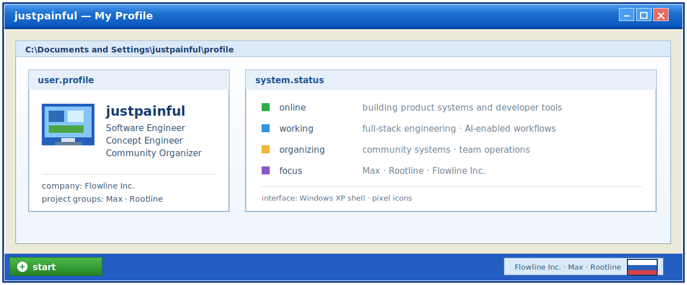
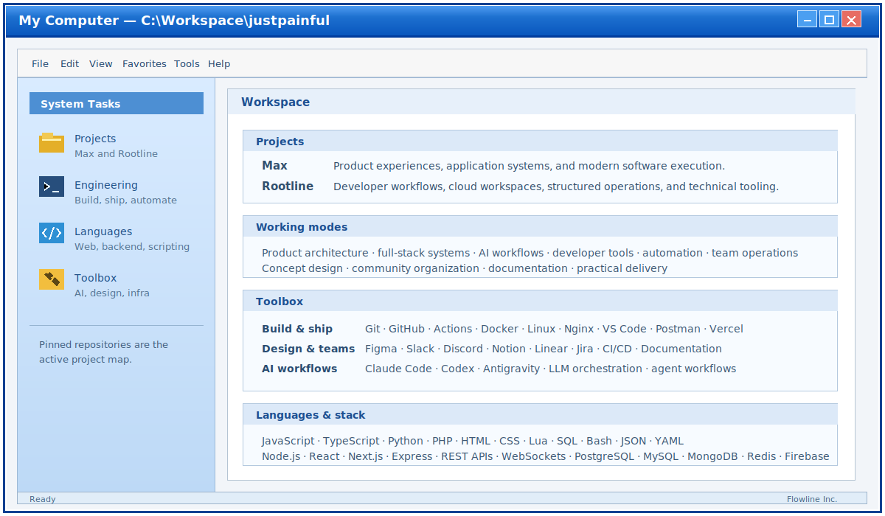

# justpainful

   <strong>Software Engineer</strong>
  &nbsp;&nbsp;
   <strong>Concept Engineer</strong>
  &nbsp;&nbsp;
   <strong>Community Organizer</strong>

I work at **Flowline Inc.** across the **Max** and **Rootline** project groups.
I build product concepts, full-stack systems, AI-assisted workflows, developer tools, and organized community infrastructure.

  

  

  

  

