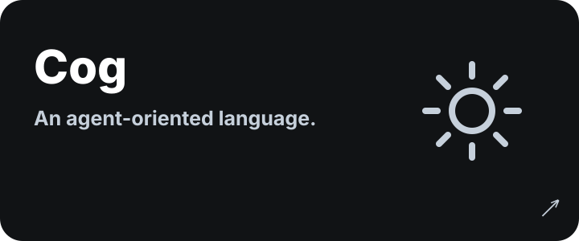
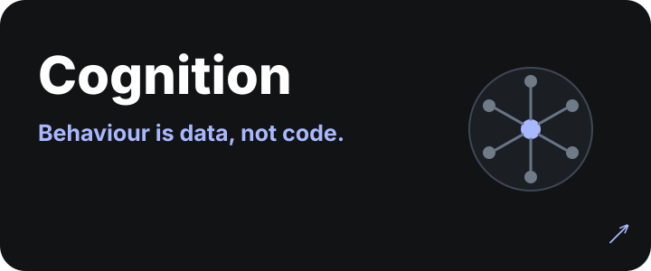
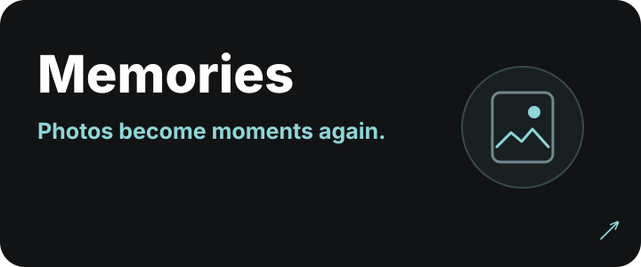
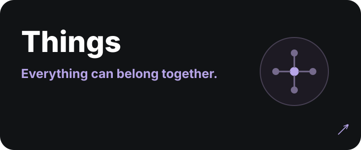
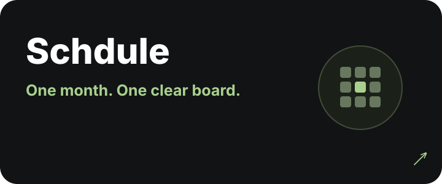
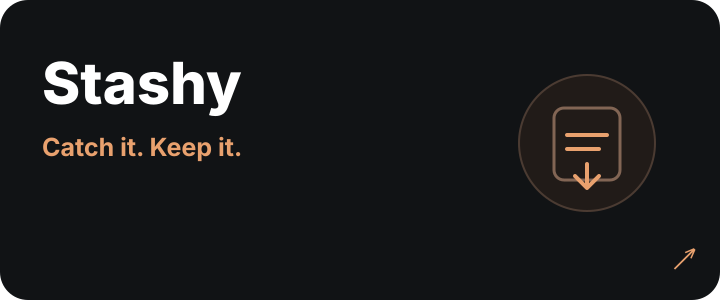

<table>
<tr>
<td align="center" width="52%">
  
</td>
<td align="center" width="48%">
  
</td>
</tr>
</table>

# Faisal Saud

**Product & Community Manager**

I lead products from idea to working system, shaping the product, architecture and execution while staying close to the technical work

Founded **Flowline** · Working at **1980**

 

## Stack

&nbsp;&nbsp;

&nbsp;&nbsp;

&nbsp;&nbsp;

 

## Selected work

<table>
<tr>
<td width="50%" valign="top">
  
</td>
<td width="50%" valign="top">
  
</td>
</tr>
<tr>
<td width="50%" valign="top">
  
</td>
<td width="50%" valign="top">
  
</td>
</tr>
<tr>
<td width="50%" valign="top">
  
</td>
<td width="50%" valign="top">
  
</td>
</tr>
</table>

 

## Now

Leading product work at **Flowline** and product and community systems at **1980**

Currently exploring agent-oriented systems through **Cog** and **Cognition** alongside independent product work

 

## Contact

[painful.sh](https://painful.sh)

 

🐧 still building.

