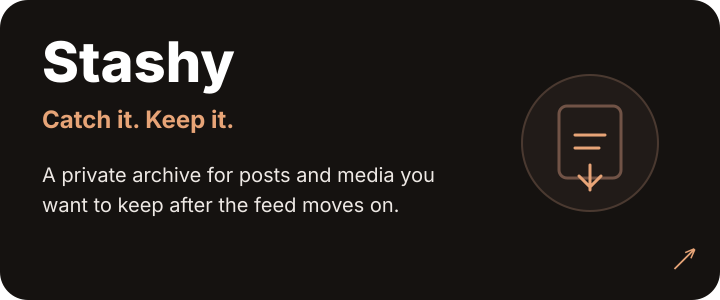
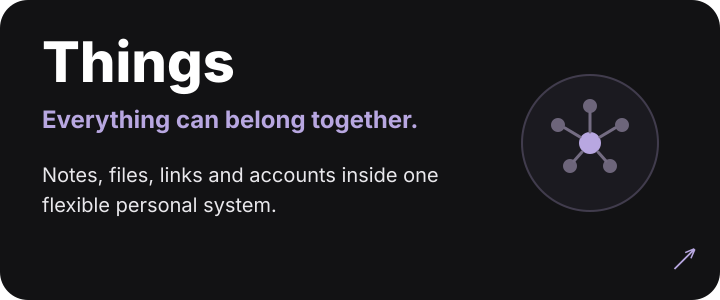
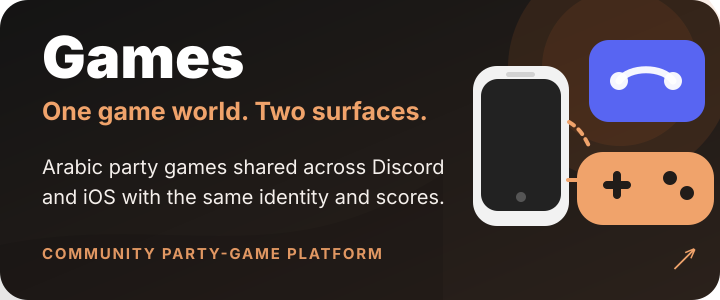
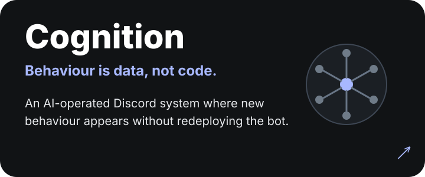

<table>
<tr>
<td align="center" width="52%">
  
</td>
<td align="center" width="48%">
  
</td>
</tr>
</table>

# Faisal Saud

**Product & Community Manager**

I turn rough ideas into products people can actually use — defining the product, shaping the experience, organizing the systems around it, and staying close to the community using it.

Founded **Flowline** &nbsp;·&nbsp; Working at **1980**

`Product direction` · `Community operations` · `Systems` · `iOS` · `Local-first`

 

## Selected work

<table>
<tr>
<td width="50%" valign="top">
  
</td>
<td width="50%" valign="top">
  
</td>
</tr>
<tr>
<td width="50%" valign="top">
  
</td>
<td width="50%" valign="top">
  
</td>
</tr>
<tr>
<td width="50%" valign="top">
  
</td>
<td width="50%" valign="top">
  
</td>
</tr>
</table>

 

### Memories — photo rediscovery without a service

A private iPhone product that turns an existing photo library into a changing stream of memories. The product decision is intentionally restrictive: no account, no backend, no cloud AI and no duplicate photo library.

**Product focus:** rediscovery · privacy · on-device intelligence · native iOS

[Open Memories →](https://github.com/justpainful/Memories)

---

### Schdule — a habit tracker that stays legible

A monthly habit and schedule tracker built around a simple board: one habit, one month, one meaningful cell per day. Digital features add state and context without turning the original paper-grid idea into a dashboard.

**Product focus:** clarity · daily state · progress · local-first

[Open Schdule →](https://github.com/justpainful/Schdule)

---

### Stashy — preservation instead of another feed

A local-first archive for public posts and media. It preserves text, attribution, media and source metadata on the device, and treats incomplete or unverifiable captures as product states rather than silently pretending a save succeeded.

**Product focus:** trustworthy capture · offline access · privacy · source transparency

[Open Stashy →](https://github.com/justpainful/Mr.Stashy)

---

### Things — one model for information that refuses neat categories

A personal information system for accounts, files, photos, links, notes, paths and structured records. Instead of forcing each item into a separate app category, the product uses one flexible model that adapts to what the user is trying to keep.

**Product focus:** information architecture · flexible data · local ownership · cross-device consistency

[Open Things →](https://github.com/justpainful/Things)

---

### Games — one product across Discord and iOS

An Arabic party-games platform built across two surfaces: a Discord bot and a native iOS app. Accounts, scores, game logic and identity belong to the product rather than to either client, so a game can move between surfaces without becoming a different experience.

**Product focus:** Arabic-first UX · community play · multi-surface systems · shared game state

[Open Games →](https://github.com/justpainful/games)

---

### Cognition — behaviour without redeploys

An AI-operated Discord system where behaviour lives in a registry instead of hard-coded handlers. The bot stays running while actions, components and server workflows can change without writing a new feature file or restarting the process.

**Product focus:** AI-operated systems · declarative behaviour · Discord operations · reversible automation

[Open Cognition →](https://github.com/justpainful/Cognition)

 

## What I work on

My work usually sits where **product, operations and community** overlap.

I define product behavior and constraints, turn ideas into specifications and workflows, make decisions about what should or should not exist, and build the systems needed to operate the result. When the product has a community around it, I also care about rollout, communication, moderation structure, feedback loops and the day-to-day experience after launch.

I stay technical enough to work directly with implementation — particularly SwiftUI, local-first systems, backend/API boundaries, CI and internal tooling — but the goal is not technology for its own sake. The goal is a product that remains understandable while it grows.

 

## Currently

**Flowline** — product work and experiments across software projects.

**1980** — product, community and operational systems around a sim-racing venue and its online community.

**Independent products** — small focused tools where privacy, ownership and clear product rules matter more than feature count.

 

## Contact

For product work, community systems or collaborations:

[painful.sh](https://painful.sh)

 

🐧 still building.

