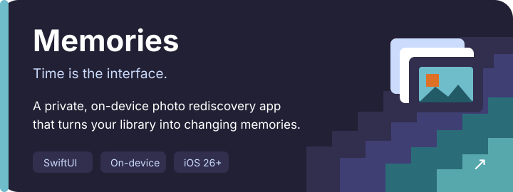
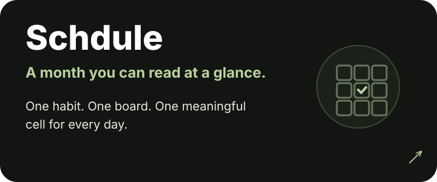

<table>
<tr>
<td align="center" width="52%">
  
</td>
<td align="center" width="48%">
  
</td>
</tr>
</table>

# Faisal Saud

**What remains after the idea.**

`Swift` · `SwiftUI` · `iOS` · `Local-first` · `Product systems`

Currently at **Flowline** &nbsp;·&nbsp; and building **1980**

 

## Selected work

<table>
<tr>
<td width="50%" valign="top">
  
</td>
<td width="50%" valign="top">
  
</td>
</tr>
</table>

### Memories

A standalone iPhone app that reads your photo library **on-device** and turns it into a daily-changing personal magazine of memories.

The important part is architectural, not cosmetic: no backend, no account, no cloud AI, no external analytics. Photos stay in Photos; the app stores identifiers and computed metadata.

**Built around:** SwiftUI · Photos · Vision · SwiftData · iOS 26+

[Open Memories →](https://github.com/justpainful/Memories)

---

### Schdule

A monthly habit and schedule tracker built around the simplicity of a paper grid: one board per habit, one cell per day — except the digital cell can carry real state, counts, notes, and progress.

Native SwiftUI, native Liquid Glass, and fully local with no account, sync service, or network dependency.

**Building toward:** month boards · streaks & stats · widgets · App Intents · exports · notifications · Face ID lock · Arabic/English

[Open Schdule →](https://github.com/justpainful/Schdule)

 

## Also building

### Stashy

**Catch it. Keep it.** A local-first iOS archive for public posts and media. A post's text, attribution, ordered media, and source metadata are preserved on the device — there is no Stashy service to send an archive to.

It reads only what a source publishes for public readers, signs in to nothing, and confirms every media address actually serves media before offering it — so a "saved" post never turns out to hold an error page.

**Built around:** SwiftUI · Tuist · SQLite · Share Extension · Arabic/English RTL

[Open Stashy →](https://github.com/justpainful/Mr.Stashy)

---

### Things

**Everything, in one place.** A completely local personal information system. Accounts, passwords, files, photos, links, notes, paths, and cards — all as one flexible kind of item.

Not a notes app, not a file manager, not a password manager. It is the place where one item can be all four at once. Two cores, TypeScript and Swift, written independently and held in agreement by conformance vectors rather than shared code.

**Built around:** SwiftUI · TypeScript · SQLite · LAN-only sync · no cloud

[Open Things →](https://github.com/justpainful/Things)

---

### games — working title

An Arabic party-games platform on two surfaces: a Discord bot that renders **every** output as a composed image, and a SwiftUI app that shares the same account, scores, and games.

Fully Arabic with real RTL layout, formal in-app naming rather than the shorthand of chat commands, and a solo mode against a three-level bot.

**Built around:** SwiftUI · Node.js · Discord OAuth2 · Prisma · XcodeGen

[Open games →](https://github.com/justpainful/games)

 

## Work

**I'm looking for a team to build with, and I take on paid work.**

iOS apps in Swift and SwiftUI, local-first architecture that keeps user data on the device, and product systems taken from spec to a shipped, tested build — including the CI that builds and screenshots it.

Reach me at [ksa1980.lol](https://ksa1980.lol) or open an issue on any repository here.

 

🐧 still building.

