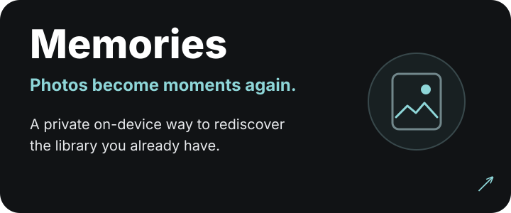
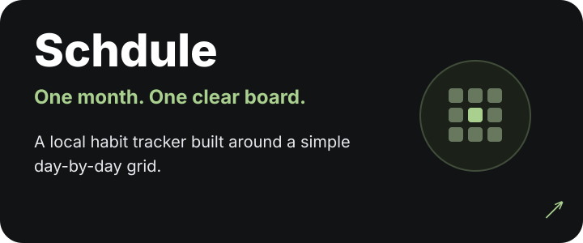
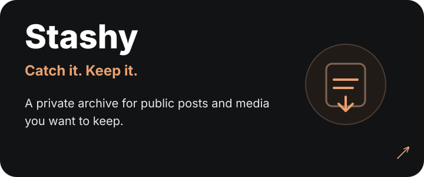
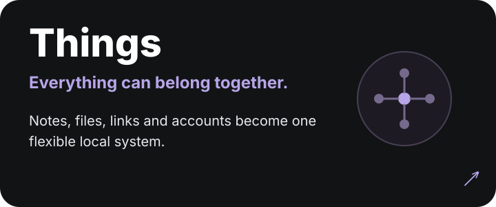
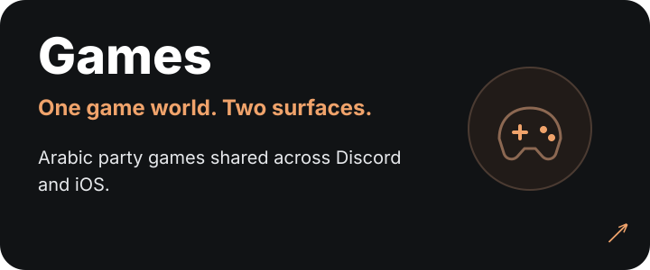

<table>
<tr>
<td align="center" width="52%">
  
</td>
<td align="center" width="48%">
  
</td>
</tr>
</table>

# Faisal Saud

**Product & Community Manager**

I turn rough ideas into products people can actually use — defining the product, shaping the experience, organizing the systems around it, and staying close to the community using it.

Founded **Flowline** &nbsp;·&nbsp; Working at **1980**

 

## Stack

&nbsp;

  

  

&nbsp;&nbsp;

&nbsp;&nbsp;

&nbsp;&nbsp;

&nbsp;&nbsp;

 

## Selected work

<table>
<tr>
<td width="50%" valign="top">
  
</td>
<td width="50%" valign="top">
  
</td>
</tr>
<tr>
<td width="50%" valign="top">
  
</td>
<td width="50%" valign="top">
  
</td>
</tr>
<tr>
<td width="50%" valign="top">
  
</td>
<td width="50%" valign="top">
  
</td>
</tr>
</table>

 

## How I work

I work across **product, community and implementation** rather than treating them as separate lanes.

The usual loop is simple: understand the problem, define the rules, remove unnecessary complexity, build the system, put it in front of real people, and keep improving it from what actually happens after launch.

I care about products that stay understandable as they grow — clear ownership, deliberate constraints, useful automation, strong operational tooling, and communities that have a direct path back into the product.

 

## Currently

**Flowline** — product work and experiments across software projects.

**1980** — product, community and operational systems around a sim-racing venue and its online community.

**Independent products** — focused software, local-first systems, internal tools and experiments.

 

## Contact

For product work, community systems or collaborations:

[painful.sh](https://painful.sh)

 

🐧 still building.

